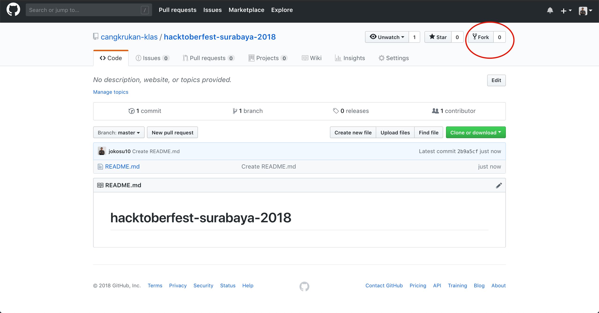
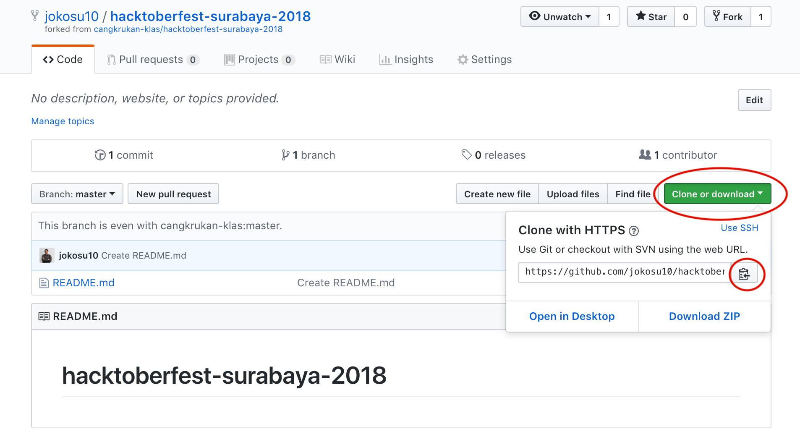

# hacktoberfest-surabaya-2018

## How to contribute

## Step by step how to contribute

## Fork repo to your repository

The first step is to create a **fork** of this repo. clicking on the **fork** button on the top of this page. A fork is basically your own working copy of this repository.


## Clone froked repo to machine

The next step is to clone the forked repo to your machine.

Go to your GitHub repositories and open the forked repository called hacktoberfest-surabaya-2018 (_forked from cangkrukan-klas/hacktoberfest-surabaya-2018_). Then click on the "Clone or download" button and then click the copy to clipboard icon to get your url.



Finally run the following git command in your terminal:

```sh
git clone "the copied url"
```

For example:

```
git clone https://github.com/jokosu10/hacktoberfest-surabaya-2018.git
```

You have now created a local clone on you computer. Good job!

## Create Branch In Local Computer

It's common practice to create a new branch for each new feature of bugfix you are working on. Let's go ahead and create one.

If you haven't already, start by changing your directory to the rebus catalog that was created when you run git clone:

```sh
cd hacktoberfest-surabaya-2018
```

create new branch for working. Running this command.

```sh
git checkout -b <your-new-branch-name>
```

> Note: Replace `your-new-branch-name` with something the changes you are about to make happen

For Example

```sh
git checkout -b add-my-profile
```

-----

### License

Licensed under the MIT License.

------

Copyleft 2018 **KLAS (Kelompok Linux Arek Suroboyo)**